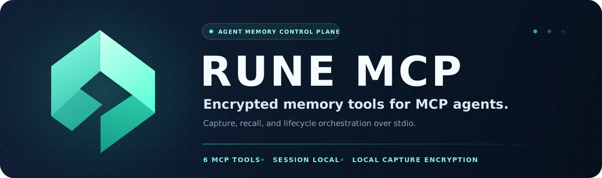

<p align="center">
  <a href="https://rune.team" aria-label="RUNE website">
    
  </a>
</p>

<p align="center">
  
</p>

<p align="center">
  <a href="https://rune.team">rune.team</a> ·
  <a href="https://rune.team/docs">Documentation</a> ·
  <a href="https://github.com/CryptoLabInc/rune-mcp/releases">Releases</a>
</p>

`rune-mcp` is the session-local MCP server behind [RUNE](https://github.com/CryptoLabInc/rune). It gives an AI agent six focused tools for connecting to a team's Console, capturing durable knowledge, and recalling the context that matters later.

Most users should install the **RUNE agent integration**, not launch this binary directly. RUNE installs and supervises `rune-mcp` together with the shared [`runed`](https://github.com/CryptoLabInc/runed) embedding daemon.

## What it owns

- **A small MCP surface.** Capture, recall, diagnostics, and lifecycle tools are exposed over stdio JSON-RPC.
- **Deterministic memory records.** Captures use a compact timestamp/author/insight/context schema instead of asking the storage layer to interpret conversations.
- **Local embedding and capture encryption.** `runed` produces the embedding on the user's machine; `rune-mcp` encrypts both RMP and MM item representations with public keys supplied by the Console.
- **Novelty and reranking policy.** Near-duplicate captures are suppressed and recall results receive recency-aware reranking.
- **Recoverable session lifecycle.** Configure, activate, deactivate, boot retry, dependency reinjection, and graceful shutdown share one state model.

## MCP tools

| Tool | Purpose |
| --- | --- |
| `configure` | Redeem a `runev1_…` registration string and pin the Console connection. |
| `activate` | Start or resume the memory pipeline after configuration or deactivation. |
| `deactivate` | Pause capture and recall without deleting the existing setup. |
| `capture` | Store one self-contained insight with optional supporting context. |
| `recall` | Retrieve semantically relevant records for a natural-language query. |
| `diagnostics` | Report environment, lifecycle, Console, key, pipeline, and embedding health. |

`capture` and `recall` are available only while the pipeline is active. Lifecycle and diagnostic tools remain available so an agent can explain and recover an incomplete setup.

## How it fits together

```text
AI agent
  │  stdio / MCP
  ▼
rune-mcp ─── local UDS ─── runed
  │                         └─ Qwen3 embedding model
  │  TLS gRPC
  ▼
Rune Console
  ├─ team identity and access policy
  ├─ FHE secret-key custody and result decryption
  └─ RuneSpace connection
          └─ encrypted vector index
```

On capture, `rune-mcp` embeds the insight locally, routes it against the current centroid set, encrypts the vector into the mandatory RMP and MM forms, seals the record metadata, and sends the resulting item through the Console. The FHE secret key never enters this process.

On recall, `rune-mcp` embeds the query locally and sends the query vector to the Console. The Console applies the caller's scope, executes the RuneSpace search, decrypts authorized results, and returns opened records for local reranking.

## Normal installation

Install RUNE from the agent-facing repository and configure it with the registration string from your workspace invitation:

```text
/plugin marketplace add https://github.com/CryptoLabInc/rune
/plugin install rune
/rune:configure
```

The bootstrap layer installs a compatible `rune-mcp` release and registers it with the supported agent runtime. See the [RUNE quick start](https://github.com/CryptoLabInc/rune#get-started-in-three-commands) for the complete user flow.

## Runtime state

Configuration lives below `~/.rune/`:

```text
~/.rune/
├── config.json       # Console endpoint, token storage mode, lifecycle state
├── console-ca.pem    # CA pinned from the registration string
├── keys/             # public capture-encryption key material
└── logs/             # optional runtime and boot logs
```

Console tokens are stored in the OS keyring when configured that way; file-based token storage remains supported for environments without a usable keyring. Files are created with user-only permissions.

Useful environment overrides:

| Variable | Effect |
| --- | --- |
| `RUNE_STATE` | Override the configured `active` or `dormant` state for this process. |
| `RUNE_MCP_LOG_FILE` | Tee redacted logs to the default file or an explicit path. |
| `RUNE_EMBEDDER_SOCKET` | Use a non-default `runed` socket. |
| `RUNE_ENCRYPTOR_IDLE` | Control how long public-key FHE contexts remain resident after capture. |

## Development

Go 1.26.4 or newer and the platform prerequisites inherited from [`runespace-sdk`](https://github.com/CryptoLabInc/runespace-sdk) are required.

```bash
go build ./cmd/rune-mcp
go vet ./...
go test ./...
```

The server uses the official Go MCP SDK and communicates over stdio. Avoid writing protocol output to stdout; structured application logs belong on stderr.

## Repository map

| Path | Responsibility |
| --- | --- |
| [`cmd/rune-mcp/`](cmd/rune-mcp/) | Process wiring, stdio server, signals, and graceful exit. |
| [`internal/mcp/`](internal/mcp/) | Tool schemas, registration, and response shaping. |
| [`internal/service/`](internal/service/) | Capture, recall, recovery, and lifecycle orchestration. |
| [`internal/policy/`](internal/policy/) | Novelty classification, UTF-8 limits, and recall reranking. |
| [`internal/adapters/`](internal/adapters/) | Console, `runed`, key storage, FHE, and metadata boundaries. |
| [`internal/lifecycle/`](internal/lifecycle/) | Boot state, dependency reinjection, and shutdown coordination. |

## License

`rune-mcp` is licensed under the [Apache License 2.0](LICENSE).

<p align="center">
  Part of <a href="https://rune.team">RUNE</a> · Built by <a href="https://www.cryptolab.co.kr/">CryptoLab</a>
</p>
