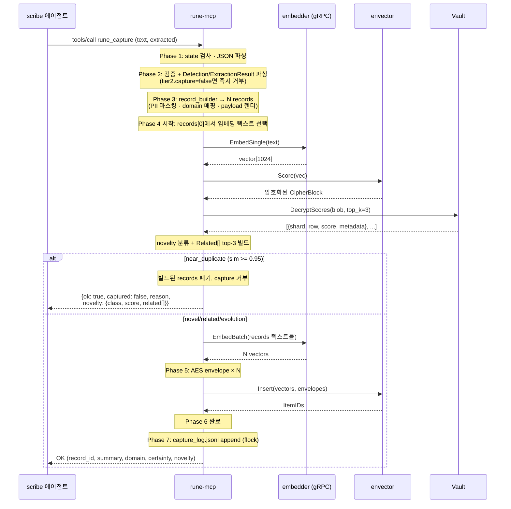

# Capture Flow — 전체 설계

rune-mcp가 scribe 에이전트의 `rune_capture` tool 호출을 처리하는 end-to-end 흐름. 7-phase로 나뉘며 각 phase에서 내려진 결정은 `overview/decisions.md`의 D1~D20에 기록되어 있다.

이 문서는 **"전체를 한 번에 훑는 레퍼런스"**. 구현 디테일·대안 근거는 `overview/decisions.md` 참조.

> **타입 참조**: `CaptureRequest`·`CaptureResponse`·`DecisionRecord v2.1`·8 enum 등 모든 도메인 타입은 `spec/types.md`에 정의. 이 문서는 flow에만 집중.

## 개요

에이전트가 의사결정 레코드를 저장하려 할 때:

1. rune-mcp가 stdio로 MCP tool call 수신
2. 입력 검증 + Detection/ExtractionResult 파싱 (tier2.capture=false면 즉시 거부)
3. `record_builder`로 DecisionRecord 조립 (PII 마스킹 · domain 매핑 · payload 렌더링) — N개 record (1~7)
4. `records[0]`의 임베딩 텍스트로 임베딩 → envector.Score → Vault.DecryptScores → novelty 분류 + Related[] 빌드 (`near_duplicate`면 빌드된 records 폐기 후 거부 응답)
5. records 전체 batch 임베딩 + AES envelope 봉인
6. envector.Insert (vectors + envelopes 한 번)
7. capture_log append + 응답

**핵심 원칙**:
- Python `mcp/server/server.py:_capture_single` + `agents/scribe/record_builder.py` 동작과 bit-identical
- agent-delegated 전제 (LLM fallback 제거, `pre_extraction` 필수)
- 모델 연산은 `embedder` 위임 (gRPC, D30) · FHE 복호화는 Vault 위임 · AES envelope은 rune-mcp 직접
- **순서 주의**: `record_builder`가 novelty check **전에** 실행 (Python `server.py:L1333` 기준). near_duplicate면 빌드된 records를 폐기하고 거부 응답하는 비용 감수 — `embedding_text`가 빌드된 records[0]에서 추출되어야 저장 vector 공간과 일치하기 때문 (`server.py:L1337` `_embedding_text_for_record(records[0])`)

## 전체 시퀀스



## Phase 1 — MCP 진입점

### 책임
- stdio JSON-RPC dispatch (공식 SDK 사용)
- state 머신 체크 (`starting`/`waiting_for_vault`/`active`/`dormant`)
- JSON 파싱 및 `CaptureRequest` 역직렬화

### 구현 형태
```go
import "github.com/modelcontextprotocol/go-sdk/mcp"

mcp.AddTool(srv, &mcp.Tool{Name: "rune_capture", Description: "..."},
    func(ctx context.Context, req *mcp.CallToolRequest, args CaptureArgs) (*mcp.CallToolResult, *CaptureResult, error) {
        if err := checkState(deps.state); err != nil { return nil, nil, err }
        return deps.captureService.Handle(ctx, args)
    })
```

### 관련 결정
- **D2**: MCP SDK = `github.com/modelcontextprotocol/go-sdk` (공식, v1.5+)

### 구현 위치
- `cmd/rune-mcp/main.go`
- `internal/mcp/tools.go` (handler)
- `internal/mcp/state.go` (state machine)

---

## Phase 2 — 검증 + tier2 체크 + Detection/ExtractionResult 파싱

### 책임
- `extracted` JSON 파싱 실패 응답 조립 (Python `server.py:L1240-1242`)
- **에이전트 tier2 판정 처리 (Python `server.py:L1244-1254`)** — `tier2.capture=false`이면 즉시 reject 응답
- `extracted` 내 알려진 필드 정규화 (phases[:7], title[:60], confidence clamp [0,1])
- Python과 동일한 silent truncate 동작
- `Detection` 객체 조립 (`tier2.domain` + `confidence` → `agent_domain`, `agent_confidence`)
- `ExtractionResult` 객체 조립 (single / phase_chain / bundle 분기)

> **참고**: 임베딩 텍스트 선택은 Phase 4에서 일어남 (Python `server.py:L1337`이 `records[0]`에서 뽑음). Phase 2는 텍스트 선택 안 함 — 이 시점엔 records가 아직 없음.

### 입력 `extracted` JSON shape (Python `server.py:L1244-1267`)

에이전트(Claude Code 등)가 보내는 `extracted` 필드의 **계약**:

> **⚠️ Legacy 3-tier 시스템과 혼동 주의**  
> Python에는 legacy `Tier2Filter` 클래스(rune-mcp 내부 LLM filter, `agents/scribe/tier2_filter.py`)가 존재하나 **Go 포팅에서 제거됨** (D14 + `spec/python-mapping.md:L128` "detector, tier2_filter, llm_extractor 삭제"). 여기 기술하는 `extracted.tier2` **JSON 필드**는 이름만 같고 의미가 다르다:  
> - Legacy Tier2Filter = rune-mcp가 내부 LLM 호출해 판정 → **Go에서 제거**  
> - `extracted.tier2` = **에이전트가 자체 판정 결과를 JSON으로 전달** (agent-delegated 계약)  
> 
> Go rune-mcp는 LLM을 직접 호출하지 않는다. `extracted.tier2.*`는 단순 dict lookup.

```json
{
  "tier2": {
    "capture": true,
    "reason": "decision + rationale present",
    "domain": "architecture"
  },
  "confidence": 0.85,
  "title": "...",
  "reusable_insight": "...",
  "phases": [ { /* max 7 */ } ],
  "payload": { "text": "..." },
  // 기타 DecisionRecord v2.1 필드 (domain, status, certainty, evidence, ...)
}
```

**필드 계약**:
| 필드 | 타입 | 기본 | 처리 |
|---|---|---|---|
| `tier2.capture` | bool | `true` | `false`면 즉시 rejection 응답 (아래) |
| `tier2.reason` | string | `"no reason"` | rejection 응답 `reason` 필드에 포함 |
| `tier2.domain` | string | `"general"` | detection에 반영 (Python `agent_domain`) |
| `confidence` | number | `None` | `[0.0, 1.0]` 클램프, 비숫자면 `None` |

### 구현 형태

```go
// internal/validate/capture.go
func Capture(req *domain.CaptureRequest) (*domain.CaptureResponse, error) {
    if strings.TrimSpace(req.Text) == "" {
        return nil, domain.ErrInvalidInput.With("reason", "text empty")
    }
    if req.Extracted == nil {
        // Python: parse_llm_json 실패 시 {"ok": false, "error": "..."}
        return nil, domain.ErrInvalidInput.With("reason", "Invalid extracted JSON — could not parse.")
    }

    // tier2 검증 — 에이전트가 이미 판정한 경우
    tier2, _ := domain.GetMap(req.Extracted, "tier2")
    capture, hasCapture := domain.GetBool(tier2, "capture")
    if hasCapture && !capture {
        // Python server.py:L1246-1251
        reason, _ := domain.GetString(tier2, "reason")
        if reason == "" { reason = "no reason" }
        return &domain.CaptureResponse{
            OK:       true,
            Captured: false,
            Reason:   fmt.Sprintf("Agent rejected: %s", reason),
        }, nil
    }

    // phases[:7], title[:60] (UTF-8 rune), confidence clamp [0,1]
    // in-place mutation, 에러 없이 정규화
    return nil, nil  // 계속 진행
}

// internal/policy/detection.go — Python _detection_from_agent_data 포팅 (server.py:L70-87)
func DetectionFromAgent(extracted map[string]any) Detection {
    tier2, _ := GetMap(extracted, "tier2")
    domain, _ := GetString(tier2, "domain")
    if domain == "" { domain = "general" }

    conf, hasConf := GetFloat(extracted, "confidence")
    if !hasConf {
        conf = 0.0  // Python: None → 0.0
    } else {
        conf = math.Max(0.0, math.Min(1.0, conf))  // clamp
    }

    return Detection{
        IsSignificant: true,  // agent-delegated 전제 (L82)
        Confidence:    conf,
        Domain:        domain,
    }
}
```

### 관련 결정
- **D3**: title 60자 rune-단위 truncate (Python 동일)
- **D4**: `extracted`는 `map[string]any` + `GetString/GetFloat/GetBool/GetMap/GetList` helper
- **D14**: agent-delegated — `tier2.domain`, `confidence` 에이전트가 제공

### 분기 · 응답 shape

#### tier2 rejection 응답 (Python L1246-1251)
```json
{
  "ok": true,
  "captured": false,
  "reason": "Agent rejected: <tier2.reason or 'no reason'>"
}
```

### 에러
| 상황 | 코드 | 응답 shape |
|---|---|---|
| `text` 빈 문자열 | `INVALID_INPUT` | `{"ok": false, "error": "text empty"}` |
| `extracted` 필드 부재/파싱 실패 | `INVALID_INPUT` | `{"ok": false, "error": "Invalid extracted JSON — could not parse."}` |
| `tier2.capture=false` | — (성공 응답) | `{"ok": true, "captured": false, "reason": "Agent rejected: ..."}` |

### 구현 위치
- `internal/validate/capture.go`
- `internal/policy/detection.go` (DetectionFromAgent)
- `internal/domain/extraction.go` (`ParseExtractionFromAgent` — wire JSON → ExtractionResult)
- `internal/domain/extracted.go` (GetString/GetFloat/GetBool/GetMap/GetList helpers)

---

## Phase 3 — record_builder.BuildPhases (DecisionRecord 조립)

### 책임
- `RawEvent` + `Detection` + `ExtractionResult` → `[]*DecisionRecord` 변환 (Python `record_builder.py` 이식, D13 Option A)
- `BuildPhases` 진입부에서 `_redact_sensitive(raw_event.text)` → `cleanText` 산출 (Python `record_builder.py:L228` bit-identical). agent-delegated 모드에서도 **항상** 실행
- `cleanText`는 extraction helpers (title/evidence/decision 추출)에 공급. `original_text` 필드에는 redact 전 원본 보존 (AES envelope으로 암호화되어 envector에 저장)
- 각 record: PII 마스킹 · quote 추출 · certainty/status 규칙 · domain 매핑 · group/phase 필드 · payload.text 렌더링 (D15)
- 결과 `records`는 1~7개 (single / phase_chain / bundle)

### 구현 형태
```go
// internal/service/capture.go — Phase 3
rawEvent := &domain.RawEvent{
    Text:    req.Text,
    Source:  req.Source,
    User:    req.User,    // 빈 문자열이면 "unknown"
    Channel: req.Channel, // 빈 문자열이면 "claude_session"
}

records, err := policy.BuildPhases(rawEvent, detection, extraction, s.Now())
if err != nil {
    return nil, fmt.Errorf("build phases: %w", err)
}
if len(records) == 0 {
    return nil, &domain.RuneError{Code: domain.CodeInternalError, Message: "build phases returned 0 records"}
}
// records[0]이 대표 record (D18 — 응답 record_id, capture_log entry, novelty embedding text)
```

### Record builder 내부 구조
```
internal/policy/
├── record_builder.go   # BuildPhases · BuildSingle · BuildMulti
├── pii.go              # Redact (5 regex SENSITIVE_PATTERNS)
├── quote.go            # ExtractQuotes (4 QUOTE_PATTERNS)
├── rationale.go        # ExtractRationale (5 patterns)
├── evidence.go         # ExtractEvidence (quote + paraphrase fallback)
├── certainty.go        # DetermineCertainty
├── status.go           # DetermineStatus / StatusFromHint
├── domain.go           # ParseDomain · ParseSourceType (19 enum + 매핑)
├── tags.go             # ExtractTags
├── title.go            # ExtractTitle
├── record_id.go        # GenerateRecordID · GenerateGroupID (Unicode-aware slug)
├── payload_text.go     # RenderPayloadText (templates.py 이식 — D15)
└── consistency.go      # EnsureEvidenceCertaintyConsistency
```

### 🔒 Canonical reference & golden fixture (D15)

`payload_text.go`는 Python `agents/common/schemas/templates.py` (363 LoC)를 **라인 단위로 미러링**. 구체 내용은 이 문서에 인라인하지 않음 — Python이 canonical.

**포팅 계약** (decisions.md D15 참조):
- `PAYLOAD_TEMPLATE` 멀티라인 format string (L14~) → Go const
- 7개 `_format_*` 헬퍼 (L52~131) → Go 함수
- `render_payload_text` 메인 (L138-222) → `RenderPayloadText`
- `render_compact_payload`, `render_display_text`는 Post-MVP

**검증**: `testdata/payload_text/golden/{id}.md` 50개 샘플 byte-for-byte 비교. **이 테스트 통과가 포팅 완료 판정 기준.**

> **Go 개발자 노트**: payload.text는 (Phase 5 batch embed 시) embedding 대상이므로 Python과 1자라도 다르면 vector 공간이 달라져 recall이 다른 결과를 냄. 반드시 Python 원본을 펼쳐놓고 라인 단위 포팅할 것.

### 🔒 Canonical reference — `record_builder.py` (D13 Option A)

`internal/policy/record_builder.go` + 관련 파일(pii/quote/evidence/certainty/status/domain/tags)은 Python `agents/scribe/record_builder.py` (703 LoC)를 **라인 단위로 미러링**. regex pattern·alias map·constant는 Python 원본이 canonical — 인라인 복제 안 함.

**Go 포팅 대상 상수**:

| Python 위치 | 이름 | 내용 |
|---|---|---|
| L227 | `MAX_INPUT_CHARS` | `12_000` — `cleanText`를 이 길이로 truncate (`~3k tokens`, 대형 입력 방어) |
| L72-77 | `QUOTE_PATTERNS` | 4개 regex: double/single/일본「」/프랑스«» 인용부호 (min 10자) |
| L80-86 | `RATIONALE_PATTERNS` | 5개: because / reason(ing) / rationale / since / due to |
| L89-95 | `SENSITIVE_PATTERNS` | 5개 redaction (email/phone/API key prefix/32+hex/card) + replacement label |

**Go 포팅 대상 매핑**:

| Python | Go 함수 | 비고 |
|---|---|---|
| `_redact_sensitive` L406-418 | `RedactSensitive` | `MAX_INPUT_CHARS` truncate 전에 호출 |
| `_parse_domain` L621-655 | `ParseDomain` | 19 enum map + **`customer_escalation` → CUSTOMER_SUCCESS alias** (L646) 필수 |
| `_parse_source_type` L657-674 | `ParseSourceType` | substring match (slack/github/notion/meeting/email/doc) → enum |
| `_extract_evidence` L498-531 | `ExtractEvidence` | QUOTE_PATTERNS 매칭 + paraphrase fallback (text[:150]+"..."). max 3개 |
| `_determine_certainty` L543-576 | `DetermineCertainty` | 3-rule (no evidence=UNKNOWN, no direct quote=PARTIALLY, no rationale=PARTIALLY, 모두=SUPPORTED). `has_direct_quotes = "paraphrase" not in claim.lower()` |
| `_status_from_hint` L604-619 | `StatusFromHint` | hint "accepted"→ACCEPTED, "rejected"/"proposed"→PROPOSED, else fallback `_determine_status` |
| `_extract_tags` L676-703 | `ExtractTags` | domain + category + `#hashtag` + 14 common keywords (microservices, monolith, database, api, security, performance, scalability, migration, refactor, deprecation, compliance, gdpr, sso, auth). unique + max 10 |
| `_build_single_record_from_extraction` L264-317 | `BuildSingleRecord` | pre_extraction이 single일 때 |
| `_build_multi_record_from_extraction` L319-404 | `BuildMultiRecord` | phase_chain / bundle. group_id + phase_seq/total + suffix (`_p{seq}` or `_b{seq}`) |

**순서 중요 (Python L196-199, L310-311, L395-396)**:
```
1. record 조립 (모든 필드 세팅, payload.text="")
2. record.ensure_evidence_certainty_consistency()  ← consistency 먼저
3. record.payload.text = render_payload_text(record)  ← rendering 마지막
4. record.reusable_insight = pre_extraction.group_summary (있으면)
```

이 순서는 Why.certainty가 강등된 후 payload.text에 반영되게 함.

**검증**: `testdata/record_builder/golden/*.json` — Python `RecordBuilder.build_phases()` 결과 JSON 덤프 (Python `scripts/gen_golden.py`) ↔ Go 출력 byte-for-byte 비교.

**D14 agent-delegated scope 축소** (Post-MVP 가능):
agent가 항상 `pre_extraction` 제공하므로 legacy regex fallback은 dead code:
- `build()` 단일 경로 (legacy, pre_extraction 없을 때)
- `_extract_context` · `_extract_rationale` · `_extract_title` 2 regex · `_determine_status` acceptance_patterns

→ 초기 구현에서 제외해도 됨 (agent-delegated mode에선 미사용). Post-MVP에 legacy 완전 제거 결정 시 삭제.

### 관련 결정
- **D13**: record_builder를 rune-mcp로 Option A 포팅 (B·C 미래 선택지)
- **D14**: LLM fallback 제거 · `pre_extraction` 필수 (없으면 `EXTRACTION_MISSING` 에러)
- **D15**: `render_payload_text` (Python `templates.py` 363 LoC) 전체 포팅

### 에러
| 상황 | 코드 | 비고 |
|---|---|---|
| `pre_extraction` 없음 (Detection은 있는데 ExtractionResult가 nil) | `EXTRACTION_MISSING` | non-retryable. agent-delegated 전제 위반 |
| record_builder 내부 에러 (regex 컴파일 등) | `RECORD_BUILD_FAILED` | non-retryable |
| `BuildPhases`가 0개 record 반환 | `INTERNAL_ERROR` | 빈 records는 invariant 위반 |

### 구현 위치
- `internal/policy/record_builder.go` + 관련 파일
- `internal/policy/payload_text.go`
- `internal/service/capture.go` (호출)

---

## Phase 4 — Novelty check (embed + Score + DecryptScores + classify + Related)

### 책임
- `records[0]`에서 임베딩 텍스트 선택 (`reusable_insight` 우선, 빈 문자열이면 `payload.text` — Python `embedding.py:embedding_text_for_record`)
- `embedder.EmbedSingle(text)` → `vector[1024]` (novelty 검사용 1회)
- `envector.Score(vec)` → 암호화된 유사도 blob 수신
- `Vault.DecryptScores(blob, top_k=3)` → 평문 top-3 점수 + metadata
- `policy.ClassifyNovelty(max_sim)` → `novel`/`related`/`evolution`/`near_duplicate` 분류
- `novelty.related[:3]` 리스트 조립 (id·title·similarity, Python `server.py:L1353-1360` 동일)
- `near_duplicate`면 빌드된 records 폐기 + 거부 응답 (Python `server.py:L1363-1369` 동일)

### 구현 형태 (Python bit-identical)

```go
// internal/service/capture.go — Phase 4
embedText := pickEmbedText(&records[0])  // records[0].ReusableInsight 우선, 없으면 records[0].Payload.Text

// 기본은 "novel" (Python L1338) — embedder/envector/Vault 어느 단계든 실패하면 이 값 유지
novelty := domain.NoveltyInfo{Class: domain.NoveltyNovel, Score: 1.0, Related: []domain.RelatedRecord{}}

vec, err := s.Embedder.EmbedSingle(ctx, embedText)
if err != nil {
    slog.WarnContext(ctx, "novelty embed failed (non-fatal)", "err", err)
    // novelty = novel 그대로, Phase 5 진행 (Python L1370-1372)
} else {
    blobs, err := s.Envector.Score(ctx, vec)
    if err == nil && len(blobs) > 0 {
        entries, err := s.Vault.DecryptScores(ctx, blobs[0], /*topK=*/ 3)
        if err == nil && len(entries) > 0 {
            maxSim := entries[0].Score  // DecryptScores는 desc sort 보장
            novelty = policy.ClassifyNovelty(maxSim)  // class + score 세팅

            // Python L1353-1360: top-3 related 조립
            n := min(3, len(entries))
            novelty.Related = make([]domain.RelatedRecord, 0, n)
            for i := 0; i < n; i++ {
                meta := entries[i].Metadata
                novelty.Related = append(novelty.Related, domain.RelatedRecord{
                    ID:         getString(meta, "id"),
                    Title:      getString(meta, "title"),
                    Similarity: roundTo3(entries[i].Score),
                })
            }
        } else if err != nil {
            slog.WarnContext(ctx, "novelty decrypt failed (non-fatal)", "err", err)
        }
    } else if err != nil {
        slog.WarnContext(ctx, "novelty score failed (non-fatal)", "err", err)
    }
}

// Python L1363-1369: near_duplicate 차단 — 빌드된 records 폐기
if novelty.Class == domain.NoveltyNearDuplicate {
    return &domain.CaptureResponse{
        OK:       true,
        Captured: false,
        Reason:   "Near-duplicate — virtually identical insight already stored",
        Novelty:  &novelty,
    }, nil
}
// Phase 5로 진행
```

### Python 정확 응답 shape (near_duplicate 시)

```json
{
  "ok": true,
  "captured": false,
  "reason": "Near-duplicate — virtually identical insight already stored",
  "novelty": {
    "class": "near_duplicate",
    "score": 0.97,
    "related": [
      {"id": "dec_2026-04-10_architecture_postgres_choice", "title": "...", "similarity": 0.97},
      {"id": "dec_2026-03-15_architecture_db_selection",    "title": "...", "similarity": 0.88}
    ]
  }
}
```

- `ok`는 **true** (에러 아님, 정책에 의한 거부)
- `captured=false` + `reason` 로 차단 통보
- `novelty.related[]`에 상위 3개 유사 record (id/title/similarity). 에이전트는 `related[0].id`로 가장 유사한 record에 접근 가능
- **`similar_to` 필드 없음** (D10 Archived — Python parity 우선)

### Python 비-fatal 처리 (L1370-1372)
```python
except Exception as e:
    logger.warning("Novelty check failed (non-fatal): %s", e)
```
embed/score/decrypt 어느 단계든 예외 시 novelty 판정 없이 (default `novel`) Phase 5로 진행 (capture 성공 유지).

### 임베딩 텍스트 선택 — `pickEmbedText(record)`

Python `embedding.py:L21-30 _embedding_text_for_record`:
```python
def _embedding_text_for_record(record):
    if record.reusable_insight and record.reusable_insight.strip():
        return record.reusable_insight
    return record.payload.text
```

Go:
```go
func pickEmbedText(r *domain.DecisionRecord) string {
    if strings.TrimSpace(r.ReusableInsight) != "" {
        return r.ReusableInsight
    }
    return r.Payload.Text
}
```

**왜 input extracted dict가 아니라 records[0]에서 뽑나** (Python `server.py:L1337` 기준):
- Phase 5 batch embed가 `records[i]`의 텍스트를 임베딩해서 envector에 저장 → recall 시 같은 vector 공간에서 유사도 비교
- Phase 4 novelty check도 같은 함수(`_embedding_text_for_record`)로 `records[0]` 텍스트를 뽑아야 vector 공간 일치
- input `extracted.payload.text`와 `records[0].Payload.Text`는 다를 수 있음 (record_builder의 `render_payload_text`로 새로 렌더되니까)
- → **embedding consistency를 위해 record_builder가 novelty 전에 돌고, novelty가 records[0]에서 텍스트를 뽑는 것이 정확한 포팅**

### 관련 결정
- ~~**D10**: `similar_to` 필드~~ **Archived (2026-04-22)** — Python parity로 drop. `novelty.related[]` 사용
- **D11**: novelty 임계값 `{0.3, 0.7, 0.95}` (Python runtime 기본값)
- **D12**: 첫 capture (top-k 빈 경우) → `similarity=0` → `novel` 판정
- **D26**: 점수 복호화 Vault 위임 (rune-mcp는 SecKey 미보유)

### 분류 기준 (Python `embedding.py:L49-56` bit-identical)

| similarity (max) | class | 의미 |
|---|---|---|
| `< 0.3` | `novel` | 완전히 새로운 내용 |
| `0.3 ~ 0.7` | `evolution` | 관련 있지만 다른 각도 (새 phase) |
| `0.7 ~ 0.95` | `related` | 같은 토픽 |
| `≥ 0.95` | `near_duplicate` | 거의 동일, capture 차단 |

**임계값**: `{0.3, 0.7, 0.95}` (Python `server.py:L102-104` runtime defaults).

> **주의**: Python `embedding.py` 모듈 상수는 `{0.4, 0.7, 0.93}`이지만 `server.py`에서 `_classify_novelty(max_sim)` 호출 시 자기 defaults `{0.3, 0.7, 0.95}`를 명시 전달 → module 상수는 dead code. runtime 동작은 0.3/0.7/0.95.

**`novelty.score` 의미**: `round(1.0 - max_similarity, 4)` — **inverted** (유사도 높을수록 score 낮음). 기존 레코드 없으면 score=1.0 (최대 novelty).

### 에러 (모두 non-fatal — Python L1370-1372)
| 상황 | 처리 |
|---|---|
| 임베딩 텍스트 빈 문자열 (records[0]의 reusable_insight·payload.text 둘 다 비었을 때) | `EMPTY_EMBED_TEXT`. record_builder가 이걸 보장해야 — 발생 시 record_builder bug |
| embedder 실패 | non-fatal warn 로그 + Phase 5 진행 (novelty=novel default) |
| envector.Score 실패 | 동일 |
| Vault.DecryptScores 실패 | 동일 |
| metadata.id 조회 실패 | `related[i].id`가 빈 문자열 ("" 유지, 판정 자체는 유효) |

### embedder gRPC 에러 매핑 (호출 시점에 일관 적용)
| gRPC | 도메인 에러 | retry |
|---|---|---|
| `UNAVAILABLE` | `EmbedderUnavailableError` | ✓ |
| `DEADLINE_EXCEEDED` | `EmbedderTimeoutError` | ✓ |
| `RESOURCE_EXHAUSTED` | `EmbedderBusyError` | ✓ |
| `INVALID_ARGUMENT` | `EmbedderInvalidInputError` | ✗ |
| 기타 | `EmbedderError(wrap)` | ✗ |

dim 검증: `Info.vector_dim`(1024 예상)과 실제 응답 `vector` 길이 불일치 시 비-retryable 에러 (모델 mismatch 방어).

### 구현 위치
- `internal/policy/novelty.go` (ClassifyNovelty)
- `internal/adapters/embedder/client.go` (EmbedSingle)
- `internal/adapters/envector/client.go` (Score)
- `internal/adapters/vault/client.go` (DecryptScores)
- `internal/service/capture.go` (호출 orchestration + Related[] 빌드 + near_duplicate 응답 조립)

---

## Phase 5 — Batch embed + AES envelope

### 책임
- `records` 전체를 batch embed (1회 gRPC 호출, D16) → N vectors
- 각 record metadata JSON을 AES-256-CTR envelope으로 봉인 → N envelopes

### 구현 형태
```go
// internal/service/capture.go — Phase 5
// 5a. batch embedding
embedTexts := make([]string, len(records))
for i, r := range records {
    embedTexts[i] = pickEmbedText(&r)  // Phase 4와 동일 함수 (reusable_insight > payload.text)
}
vectors, err := s.Embedder.EmbedBatch(ctx, embedTexts)  // embedder EmbedBatch 1회 (D16)
if err != nil {
    return nil, fmt.Errorf("embed batch: %w", err)
}

// 5b. AES envelope (Python envector_sdk.py:L227-234 _app_encrypt_metadata)
envelopes := make([]string, len(records))
for i, r := range records {
    body, _ := json.Marshal(r)
    envelopes[i], err = envector.Seal(s.AgentDEK, s.AgentID, body)
    if err != nil {
        return nil, fmt.Errorf("seal record %d: %w", i, err)
    }
}
```

### AES envelope 포맷

```json
{"a": "agent_xyz", "c": "base64(IV(16B) || CT)"}
```

- **`"a"`** = agent_id (Vault 번들에서 받은 식별자)
- **`"c"`** = `base64(IV ‖ AES-256-CTR(agent_dek, metadata_json_utf8))`

상세 (알고리즘·Go 구현·MAC 미존재 등)는 `spec/components/rune-mcp.md` "AES envelope" 섹션 참조 (pyenvector `mcp/adapter/envector_sdk.py:L227-234` bit-identical).

### 관련 결정
- **D7**: embedder retry backoff `[0, 500ms, 2s]`
- **D16**: multi-record embedding은 batch 1회 (N개 개별 호출 아님)
- **D26**: capture는 rune-mcp 직접 봉인 (recall은 Vault 위임 — 비대칭)
- **D1** (Deferred): AES-MAC envelope 추가 (현재 CTR 단독, malleability 잔존)

### 에러
| 상황 | 코드 | retry |
|---|---|---|
| embedder batch 실패 | `EMBEDDER_*` (Phase 4와 동일 매핑) | ✓ |
| `agent_dek` 길이 ≠ 32 | `INVALID_DEK` | ✗ |
| `agent_id` 빈 문자열 | (Python `envector_sdk.py:L250-251` skip) | safety check, 정상 흐름엔 없음 |
| JSON marshal 실패 | `INTERNAL_ERROR` | ✗ |

### 구현 위치
- `internal/policy/embedtext.go` (`pickEmbedText` — Phase 4·5 공유)
- `internal/adapters/embedder/client.go` (EmbedBatch)
- `internal/adapters/envector/aes_ctr.go` (Seal · Open)
- `internal/service/capture.go` (호출)

---

## Phase 6 — envector.Insert

### 책임
- vectors + envelopes를 envector-go SDK의 `InsertRequest`로 전달
- Batch atomic 전제 — 실패 시 전체 재시도

### 구현 형태
```go
result, err := s.Envector.Insert(ctx, envector.InsertRequest{
    Vectors:  vectors,
    Metadata: envelopes,
})
if err != nil {
    return nil, domain.ErrEnvectorInsertFailed.With("cause", err.Error())
}
if len(result.ItemIDs) != len(vectors) {
    // atomicity 가정 위배 — 이상 케이스, 로그 + 에러
    slog.ErrorContext(ctx, "atomicity violation", "expected", len(vectors), "got", len(result.ItemIDs))
    return nil, domain.ErrEnvectorInconsistent
}
```

### 관련 결정
- **D17**: atomic batch 가정. Phase 2 integration test 시점에 실측 확정. partial-failure 관찰 시 재검토
- **D18**: 응답 `record_id = records[0].id` (Python 동일, 첫 레코드만 대표)

### 에러
| 상황 | 처리 |
|---|---|
| gRPC 연결 실패 (일시) | SDK 내장 keepalive 자동 재연결 · 실패 시 `ENVECTOR_UNAVAILABLE` (retryable) |
| `len(ItemIDs) != len(Vectors)` | atomicity 위반 의심. 즉시 에러 + 구조적 로그 (D17 재검토 trigger) |
| ActivateKeys 미수행 | 부팅 시 보장하므로 정상 흐름엔 없음. 발생 시 재시도 |

### 구현 위치
- `internal/adapters/envector/client.go` (Insert 래퍼)
- `internal/service/capture.go` (호출)

---

## Phase 7 — capture_log + 최종 응답

### 책임
- `~/.rune/capture_log.jsonl` 한 줄 append (0600, flock으로 multi-process 안전)
- 응답 JSON 반환 (Python `server.py:1388-1398`와 동일 shape)

### 구현 형태
```go
// Phase 7a: capture_log append (best-effort)
entry := domain.LogEntry{
    TS:           clock.Now().UTC().Format(time.RFC3339Nano),
    Action:       "captured",
    ID:           records[0].ID,
    Title:        records[0].Title,
    Domain:       string(records[0].Domain),
    Mode:         "agent-delegated",
    NoveltyClass: string(novelty.Class),
    NoveltyScore: &novelty.Score,
}
if err := s.captureLog.Append(entry); err != nil {
    slog.ErrorContext(ctx, "capture_log append failed", "err", err)
    // 에러 무시 · capture 성공 유지
}

// Phase 7b: 응답
return &domain.CaptureResponse{
    OK:        true,
    Captured:  true,
    RecordID:  records[0].ID,
    Summary:   records[0].Title,
    Domain:    string(records[0].Domain),
    Certainty: string(records[0].Why.Certainty),
    Novelty:   &novelty,
}, nil
```

### 로그 포맷 (Python bit-identical)
```json
{
  "ts": "2026-04-21T10:30:00.123456+00:00",
  "action": "captured",
  "id": "dec_2026-04-21_architecture_postgres_choice",
  "title": "PostgreSQL 선택",
  "domain": "architecture",
  "mode": "agent-delegated",
  "novelty_class": "novel",
  "novelty_score": 0.23
}
```

- `ensure_ascii=False` (한글 escape 안 함) — Go `json.Marshal` 기본 동작과 일치
- `novelty_class`/`novelty_score`는 omitempty (pointer로 명시적 nil 처리)
- multi-record여도 첫 레코드만 로그 (`first.id`, `first.title`, `first.domain`)

### 관련 결정
- **D19**: append 실패 시 degrade (capture 성공 응답 유지)
- **D20**: jsonl 포맷 Python bit-identical (같은 파일 혼재 append 호환)

### 구현 위치
- `internal/adapters/logio/capture_log.go`
- `internal/domain/capture.go` (CaptureResponse)

---

## 전체 에러 경로 요약

| Phase | 상황 | 응답 코드 | Retryable |
|---|---|---|---|
| 1 | state=starting | `STARTING` | ✓ |
| 1 | state=waiting_for_vault | `VAULT_PENDING` | ✓ |
| 1 | state=dormant | `DORMANT` | ✗ |
| 1 | JSON 파싱 실패 | `INVALID_INPUT` | ✗ |
| 2 | `text` 빈 문자열 | `INVALID_INPUT` | ✗ |
| 2 | `extracted` 부재/파싱 실패 | `INVALID_INPUT` | ✗ |
| 2 | `tier2.capture=false` | (ok=true, captured=false 응답) | — |
| 3 | `pre_extraction` 없음 | `EXTRACTION_MISSING` | ✗ |
| 3 | record_builder 내부 에러 (regex 등) | `RECORD_BUILD_FAILED` | ✗ |
| 3 | `BuildPhases`가 0 record 반환 | `INTERNAL_ERROR` | ✗ |
| 4 | records[0] embed 텍스트 빈 문자열 | `EMPTY_EMBED_TEXT` | ✗ (record_builder bug 신호) |
| 4 | embedder 미기동 / 모델 로드 중 | `EMBEDDER_UNAVAILABLE` / `EMBEDDER_NOT_READY` | ✓ (retry 3회) |
| 4 | embedder timeout | `EMBEDDER_TIMEOUT` | ✓ |
| 4 | vector dim ≠ 1024 | `EMBEDDER_DIM_MISMATCH` | ✗ |
| 4 | envector.Score / Vault.DecryptScores 실패 | **non-fatal warn 로그** + Phase 5 진행 (novelty=novel default) | — |
| 4 | near_duplicate | (ok=true, captured=false 응답) | — |
| 5 | DEK 길이 ≠ 32 | `INVALID_DEK` | ✗ |
| 5 | batch embed 실패 | `EMBEDDER_*` (Phase 4와 동일 매핑) | ✓ |
| 5 | AES seal 실패 | `INTERNAL_ERROR` | ✗ |
| 6 | envector.Insert 실패 | `ENVECTOR_INSERT_FAILED` | ✓ |
| 6 | `len(ItemIDs) != len(Vectors)` | `ENVECTOR_INCONSISTENT` | ✗ (D17 재검토 trigger) |
| 7 | capture_log append 실패 | **Degrade (성공 응답 유지)** | — |
| 전역 | handler panic | `INTERNAL_ERROR` (MCP SDK 수준 recover) | — |

## 관련 결정 색인

| Phase | 결정 번호 |
|---|---|
| 1 (MCP 진입점) | D2 |
| 2 (검증 + Detection/ExtractionResult 파싱) | D3, D4, D14 |
| 3 (record_builder + DecisionRecord 조립) | D13, D14, D15 |
| 4 (embed + score + decrypt + classify) | D7, D8, D11, D12, D26, D30 (D6, D9, D10 Archived) |
| 5 (batch embed + AES envelope) | D7, D16, D26, D1 (Deferred) |
| 6 (envector.Insert) | D17, D18 |
| 7 (capture_log + 응답) | D19, D20 |

결정 상세(배경·선택지·근거·구현·재평가 트리거)는 `docs/v04/decisions.md` 참조.

## 패키지 레이아웃 (capture flow 관여 파일)

```
cmd/rune-mcp/main.go                          # 진입점 + lifecycle 초기화

internal/mcp/
├── server.go                                  # MCP SDK 래핑
├── tools.go                                   # 8 tool handlers (capture 포함)
└── state.go                                   # state machine

internal/validate/
└── capture.go                                 # Phase 2 검증 + 정규화

internal/policy/
├── detection.go                               # Phase 2 DetectionFromAgent
├── embedtext.go                               # Phase 4·5 pickEmbedText (records[0] 또는 N records)
├── novelty.go                                 # Phase 4 ClassifyNovelty
├── record_builder.go                          # Phase 3 메인
├── pii.go · quote.go · rationale.go
├── evidence.go · certainty.go · status.go
├── domain.go · tags.go · title.go
├── record_id.go · consistency.go
└── payload_text.go                            # Phase 3 templates 이식

internal/adapters/
├── embedder/client.go                         # Phase 4·5 gRPC client (EmbedSingle, EmbedBatch)
├── embedder/info_cache.go                      # Info sync.Once 캐시
├── embedder/retry.go                           # D7 backoff
├── envector/client.go                         # Phase 4·6 SDK 래퍼 (Score, Insert)
├── envector/aes_ctr.go                        # Phase 5 Seal / Open
├── vault/client.go                            # Phase 4 DecryptScores
└── logio/capture_log.go                       # Phase 7

internal/service/
└── capture.go                                 # Phase 1-7 orchestration

internal/domain/
├── capture.go                                 # CaptureRequest / Response
├── decision_record.go                         # v2.1 전체 struct
├── raw_event.go · detection.go · extraction.go
├── novelty.go                                 # NoveltyInfo / RelatedRecord
└── logio.go                                   # LogEntry
```

## 테스트 전략

- **Unit (policy/)**: pure function · golden fixture Python ↔ Go 비교
- **Unit (validate, adapters)**: mock 기반
- **Concurrency (synctest)**: retry backoff · state 전환 결정적 테스트 (Go 1.25 `testing/synctest`)
- **Integration (`//go:build integration`)**: 실 embedder + 실 envector + 실 Vault 왕복
- **E2E**: rune-mcp 프로세스 spawn + stdio JSON-RPC + 에이전트 시뮬레이션

## 관련 문서

- **Recall flow**: `spec/flows/recall.md` (완성, 7-phase)
- **Lifecycle flow**: `spec/flows/lifecycle.md` (완성, 6-tool + 부팅·Vault retry·shutdown)
- **Phase chain expansion**: D27에서 MVP 유지 결정. `spec/flows/recall.md` Phase 6 참조
- **에이전트 ExtractionResult shape**: `overview/decisions.md` D4 `extracted` JSON 계약 참조
