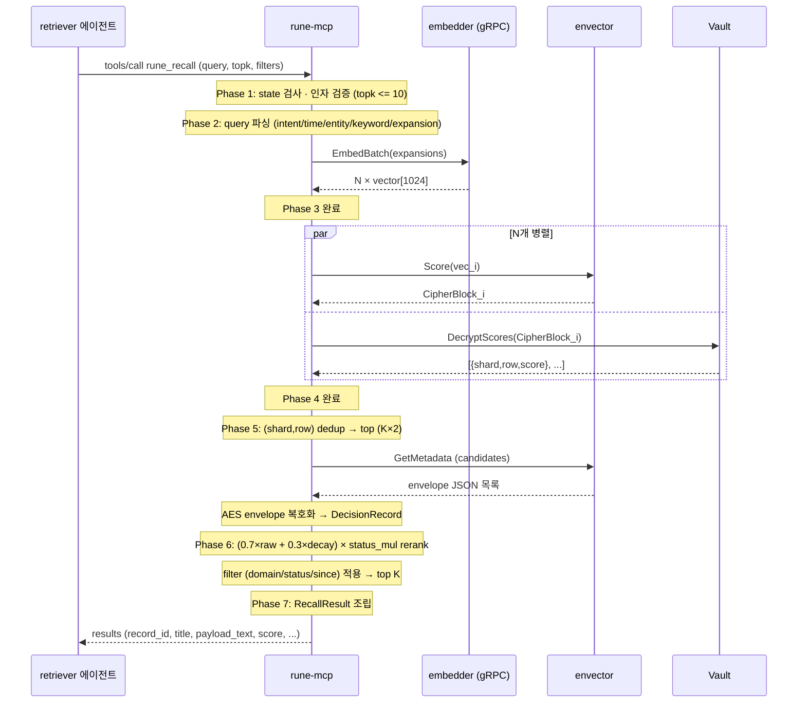

# Recall Flow — 전체 설계

rune-mcp가 retriever 에이전트의 `rune_recall` tool 호출을 처리하는 end-to-end 흐름. 7-phase로 나뉘며 각 phase에서 내려진 결정은 `overview/decisions.md`에 기록된다.

이 문서는 **"전체를 한 번에 훑는 레퍼런스"**. 구현 디테일·대안 근거는 `overview/decisions.md` 참조.

> **타입 참조**: `RecallArgs`·`RecallResult`·`SearchHit`·`ParsedQuery`·`QueryIntent`·`TimeScope` 등 모든 도메인 타입은 `spec/types.md`에 정의. 이 문서는 flow에만 집중.

## 개요

에이전트가 사용자 질문으로 조직 메모리를 검색할 때:

1. rune-mcp가 stdio로 MCP tool call 수신 (query, topk, domain, status, since)
2. Query 파싱 — intent · time scope · entity · keyword · expansion 생성 (English regex)
3. `embedder` (외부 gRPC 프로세스)에 expansion 전체 batch 임베딩 요청
4. envector `Score` N회 (expansion 수만큼) 병렬 + Vault `DecryptScores` 병렬
5. 중복 제거 → top-k × 2 후보에 대해 `GetMetadata` → AES envelope 복호화
6. Rerank — `(0.7 × raw + 0.3 × decay) × status_mul` 후 filter 적용 → top-k
7. 응답 조립 — raw results 반환 (synthesis 없음, agent-delegated)

**핵심 원칙**:
- Python `mcp/server/server.py` + `agents/retriever/*.py` 동작과 bit-identical
- **agent-delegated**: query translation은 agent 담당 (D21), synthesis도 agent 담당 (raw results 반환)
- 모델 연산은 `embedder` 위임 (gRPC, D30) · FHE 복호화는 Vault 위임 · AES envelope 복호화는 rune-mcp 직접

## 전체 시퀀스



---

## Phase 1 — MCP 진입점

### 책임
- stdio JSON-RPC dispatch (공식 SDK 사용)
- state 머신 체크 (`starting`/`waiting_for_vault`/`active`/`dormant`)
- JSON 파싱 및 `RecallArgs` 역직렬화
- `topk` 상한 검증 (`> 10` 시 `InvalidInputError`)

### 구현 형태

```go
type RecallArgs struct {
    Query  string  `json:"query"`
    TopK   int     `json:"topk,omitempty"`   // default 5, max 10
    Domain *string `json:"domain,omitempty"`
    Status *string `json:"status,omitempty"`
    Since  *string `json:"since,omitempty"`   // ISO date
}

type RecallResult struct {
    Results  []RecallHit `json:"results"`
    Query    string      `json:"query"`
    TopK     int         `json:"topk"`
    Mode     string      `json:"mode"` // "raw" (agent-delegated)
}

type RecallHit struct {
    RecordID    string  `json:"record_id"`
    Title       string  `json:"title"`
    Domain      string  `json:"domain"`
    Status      string  `json:"status"`
    PayloadText string  `json:"payload_text"`
    Certainty   string  `json:"certainty"`
    Score       float64 `json:"score"`
    Decay       float64 `json:"decay,omitempty"`
    IsReliable  bool    `json:"is_reliable"`
}

mcp.AddTool(srv, &mcp.Tool{Name: "rune_recall", Description: "..."},
    func(ctx context.Context, req *mcp.CallToolRequest, args RecallArgs) (*mcp.CallToolResult, *RecallResult, error) {
        if err := checkState(deps.state); err != nil { return nil, nil, err }
        if strings.TrimSpace(args.Query) == "" {
            return nil, nil, invalidInput("query is empty")
        }
        if args.TopK == 0 { args.TopK = 5 }
        if args.TopK > 10 { return nil, nil, invalidInput("topk must be 10 or less.") }
        return deps.recallService.Handle(ctx, args)
    })
```

### 관련 결정
- **D2**: MCP SDK = `github.com/modelcontextprotocol/go-sdk` (공식, v1.5+)
- **D24**: 빈 쿼리 early reject (Phase 1에서 `InvalidInputError`)
- TopK default 5 / max 10 — Python `server.py:912,930` 그대로

### 에러
- State = `dormant` → `PipelineNotReadyError`
- `query` 공백만 → `InvalidInputError("query is empty")` (D24)
- `topk > 10` → `InvalidInputError`

### 구현 위치
- `cmd/rune-mcp/main.go`
- `internal/mcp/tools.go` (handler)
- `internal/mcp/state.go` (state machine)

---

## Phase 2 — Query 파싱

### 책임
자연어 쿼리를 검색에 유리한 형태로 분해:
1. Text cleaning (lowercase, whitespace 정규화, trailing punctuation 제거)
2. Intent 감지 (31 regex across 7 categories → 8 enum)
3. Time scope 감지 (16 regex across 4 categories → 5 enum)
4. Entity 추출 (quoted · capitalized · tech patterns · dedup → 상위 10개)
5. Keyword 추출 (81 stopwords · len>2 필터 · dedup → 상위 15개)
6. Query expansion 생성 (intent별 + entity별 · dedup → 상위 5개)

### 입력 가정 (D21)

- rune-mcp는 **English query만** 파싱
- Non-English 쿼리는 agent (Claude Code 등)가 호출 전 영어로 번역하여 전달
- Multilingual LLM path는 Go rune-mcp에 **구현하지 않음**
- 상세는 `overview/decisions.md` D21 참조

### 구현 형태

#### Parsed 자료구조

```go
package query

type Intent string
const (
    IntentDecisionRationale  Intent = "decision_rationale"
    IntentFeatureHistory     Intent = "feature_history"
    IntentPatternLookup      Intent = "pattern_lookup"
    IntentTechnicalContext   Intent = "technical_context"
    IntentSecurityCompliance Intent = "security_compliance"
    IntentHistoricalContext  Intent = "historical_context"
    IntentAttribution        Intent = "attribution"
    IntentGeneral            Intent = "general"
)

type TimeScope string
const (
    TimeScopeLastWeek    TimeScope = "last_week"
    TimeScopeLastMonth   TimeScope = "last_month"
    TimeScopeLastQuarter TimeScope = "last_quarter"
    TimeScopeLastYear    TimeScope = "last_year"
    TimeScopeAllTime     TimeScope = "all_time"
)

type Parsed struct {
    Original        string
    Cleaned         string
    Intent          Intent
    TimeScope       TimeScope
    Entities        []string
    Keywords        []string
    ExpandedQueries []string
}
```

#### Parse 함수 — 순차 6단계

```go
func Parse(q string) Parsed {
    cleaned := cleanQuery(q)
    intent := detectIntent(cleaned)
    entities := extractEntities(q)            // 원본 (대소문자 보존)
    return Parsed{
        Original:        q,
        Cleaned:         cleaned,
        Intent:          intent,
        TimeScope:       detectTimeScope(cleaned),
        Entities:        entities,
        Keywords:        extractKeywords(cleaned),
        ExpandedQueries: generateExpansions(cleaned, intent, entities),
    }
}
```

#### 1. cleanQuery

```go
func cleanQuery(q string) string {
    s := strings.ToLower(strings.TrimSpace(q))
    s = reWhitespace.ReplaceAllString(s, " ")
    s = reTrailingPunct.ReplaceAllString(s, "")  // .!,;: 제거, ? 보존
    return s
}

var (
    reWhitespace    = regexp.MustCompile(`\s+`)
    reTrailingPunct = regexp.MustCompile(`[.!,;:]+$`)
)
```

#### 2. detectIntent — 31 regex (order-sensitive)

Python `INTENT_PATTERNS` 딕셔너리는 Python 3.7+에서 insertion-order 보장. Go `map`은 무순이므로 **ordered slice**로 이식:

```go
type intentRule struct {
    intent   Intent
    patterns []*regexp.Regexp
}

var intentRules = []intentRule{
    {IntentDecisionRationale, compileAll([]string{
        `(?i)why did we (choose|decide|go with|select|pick)`,
        `(?i)what was the (reasoning|rationale|logic|thinking)`,
        `(?i)why .+ over .+`,
        `(?i)what were the (reasons|factors)`,
        `(?i)why (not|didn't we)`,
        `(?i)reasoning behind`,
    })},
    {IntentFeatureHistory, compileAll([]string{
        `(?i)(have|did) (customers?|users?) (asked|requested|wanted)`,
        `(?i)feature request`,
        `(?i)why did we (reject|say no|decline)`,
        `(?i)(how many|which) customers`,
        `(?i)customer feedback (on|about)`,
    })},
    {IntentPatternLookup, compileAll([]string{
        `(?i)how do we (handle|deal with|approach|manage)`,
        `(?i)what'?s our (approach|process|standard|convention)`,
        `(?i)is there (an?|existing) (pattern|standard|convention)`,
        `(?i)what'?s the (best practice|recommended way)`,
        `(?i)how should (we|i)`,
    })},
    {IntentTechnicalContext, compileAll([]string{
        `(?i)what'?s our (architecture|design|system) for`,
        `(?i)how (does|is) .+ (implemented|built|designed)`,
        `(?i)(explain|describe) (the|our) .+ (system|architecture|design)`,
        `(?i)technical (details|overview) (of|for)`,
    })},
    {IntentSecurityCompliance, compileAll([]string{
        `(?i)(security|compliance) (requirements?|considerations?)`,
        `(?i)what (security|privacy) (measures|controls)`,
        `(?i)(gdpr|hipaa|sox|pci) (requirements?|compliance)`,
        `(?i)audit (requirements?|trail)`,
    })},
    {IntentHistoricalContext, compileAll([]string{
        `(?i)when did we (decide|choose|implement|launch)`,
        `(?i)(history|timeline) of`,
        `(?i)(have|did) we (ever|previously)`,
        `(?i)how long (have|has) .+ been`,
    })},
    {IntentAttribution, compileAll([]string{
        `(?i)who (decided|chose|approved|owns)`,
        `(?i)which (team|person|group) (is responsible|decided|owns)`,
        `(?i)(owner|maintainer) of`,
    })},
}

func detectIntent(q string) Intent {
    for _, rule := range intentRules {
        for _, p := range rule.patterns {
            if p.MatchString(q) {
                return rule.intent
            }
        }
    }
    return IntentGeneral
}
```

#### 3. detectTimeScope — 16 regex

```go
var timeRules = []struct {
    scope    TimeScope
    patterns []*regexp.Regexp
}{
    {TimeScopeLastWeek, compileAll([]string{
        `(?i)last week`, `(?i)this week`, `(?i)past week`, `(?i)7 days`,
    })},
    {TimeScopeLastMonth, compileAll([]string{
        `(?i)last month`, `(?i)this month`, `(?i)past month`, `(?i)30 days`,
    })},
    {TimeScopeLastQuarter, compileAll([]string{
        `(?i)last quarter`, `(?i)this quarter`, `(?i)Q[1-4]`, `(?i)past 3 months`,
    })},
    {TimeScopeLastYear, compileAll([]string{
        `(?i)last year`, `(?i)this year`, `20\d{2}`, `(?i)past year`,
    })},
}
```

#### 4. extractEntities — 4단계

**원본 쿼리 (대소문자 보존)** 받음:

```go
func extractEntities(q string) []string {
    var entities []string
    seen := map[string]struct{}{}

    add := func(e string) {
        if len(e) <= 1 { return }
        if _, ok := seen[e]; ok { return }
        seen[e] = struct{}{}
        entities = append(entities, e)
    }

    // Stage 1: quoted strings (single + double)
    for _, m := range reQuoted.FindAllStringSubmatch(q, -1) {
        if m[1] != "" { add(m[1]) } else if m[2] != "" { add(m[2]) }
    }

    // Stage 2: capitalized words (i > 0), multi-word phrases 병합
    words := strings.Fields(q)
    for i := 1; i < len(words); i++ {
        w := words[i]
        if len(w) > 1 && unicode.IsUpper(rune(w[0])) {
            phrase := []string{w}
            for j := i + 1; j < len(words); j++ {
                if len(words[j]) == 0 || !unicode.IsUpper(rune(words[j][0])) { break }
                phrase = append(phrase, words[j])
            }
            add(strings.Join(phrase, " "))
        }
    }

    // Stage 3: tech name regex 4 groups
    for _, re := range techPatterns {
        for _, m := range re.FindAllString(q, -1) {
            add(m)
        }
    }

    // Stage 4: cap at 10
    if len(entities) > 10 {
        entities = entities[:10]
    }
    return entities
}

var (
    reQuoted      = regexp.MustCompile(`"([^"]+)"|'([^']+)'`)
    techPatterns = []*regexp.Regexp{
        regexp.MustCompile(`(?i)\b(PostgreSQL|MySQL|MongoDB|Redis|Elasticsearch|Kafka)\b`),
        regexp.MustCompile(`(?i)\b(React|Vue|Angular|Next\.js|Node\.js|Python|Java|Go)\b`),
        regexp.MustCompile(`(?i)\b(AWS|GCP|Azure|Kubernetes|Docker|Terraform)\b`),
        regexp.MustCompile(`(?i)\b(REST|GraphQL|gRPC|WebSocket|HTTP|HTTPS)\b`),
    }
)
```

#### 5. extractKeywords — 81 stopwords

```go
func extractKeywords(cleaned string) []string {
    words := reWordBoundary.FindAllString(cleaned, -1)
    var keywords []string
    seen := map[string]struct{}{}
    for _, w := range words {
        if len(w) <= 2 { continue }
        if _, stop := stopWords[w]; stop { continue }
        if _, dup := seen[w]; dup { continue }
        seen[w] = struct{}{}
        keywords = append(keywords, w)
        if len(keywords) >= 15 { break }
    }
    return keywords
}

var reWordBoundary = regexp.MustCompile(`\w+`)

var stopWords = map[string]struct{}{
    "the": {}, "a": {}, "an": {}, "is": {}, "are": {}, "was": {}, "were": {},
    "be": {}, "been": {}, "being": {}, "have": {}, "has": {}, "had": {},
    "do": {}, "does": {}, "did": {}, "will": {}, "would": {}, "could": {},
    "should": {}, "may": {}, "might": {}, "must": {}, "shall": {}, "can": {},
    "need": {}, "dare": {}, "ought": {}, "used": {}, "to": {}, "of": {},
    "in": {}, "for": {}, "on": {}, "with": {}, "at": {}, "by": {}, "from": {},
    "up": {}, "about": {}, "into": {}, "over": {}, "after": {},
    "we": {}, "our": {}, "us": {}, "i": {}, "me": {}, "my": {}, "you": {},
    "your": {}, "it": {}, "its": {}, "they": {}, "them": {}, "their": {},
    "this": {}, "that": {}, "these": {}, "those": {}, "what": {}, "which": {},
    "who": {}, "whom": {}, "when": {}, "where": {}, "why": {}, "how": {},
    "and": {}, "or": {}, "but": {}, "if": {}, "because": {}, "as": {},
    "until": {}, "while": {}, "although": {}, "though": {}, "even": {},
    "just": {}, "also": {},
}
```

#### 6. generateExpansions — intent + entity 기반

```go
func generateExpansions(cleaned string, intent Intent, entities []string) []string {
    expansions := []string{cleaned}

    switch intent {
    case IntentDecisionRationale:
        expansions = append(expansions,
            "decision "+cleaned, "rationale "+cleaned, "trade-off "+cleaned)
    case IntentFeatureHistory:
        expansions = append(expansions,
            "customer request "+cleaned, "feature rejected "+cleaned)
    case IntentPatternLookup:
        expansions = append(expansions,
            "standard approach "+cleaned, "best practice "+cleaned)
    case IntentTechnicalContext:
        expansions = append(expansions,
            "architecture "+cleaned, "implementation "+cleaned)
    }

    for i, e := range entities {
        if i >= 3 { break }
        expansions = append(expansions, e+" decision", "why "+e)
    }

    // dedup (lowercase key, preserve original case)
    seen := map[string]struct{}{}
    var unique []string
    for _, exp := range expansions {
        k := strings.ToLower(exp)
        if _, ok := seen[k]; ok { continue }
        seen[k] = struct{}{}
        unique = append(unique, exp)
        if len(unique) >= 5 { break }
    }
    return unique
}
```

### 관련 결정
- **D21**: multilingual path 제거, agent-side 사전 번역
- Python bit-identical 포팅이므로 추가 결정 없음

### 에러
Phase 2는 **에러 반환 없음**. 빈 쿼리도 `Parsed{}` 구조체로 downstream에 전달 (downstream에서 expansion=[] 시 스킵).

### 구현 위치
- `internal/policy/query/parse.go` — `Parse` 진입점
- `internal/policy/query/intent.go` — intentRules + detectIntent
- `internal/policy/query/time.go` — timeRules + detectTimeScope
- `internal/policy/query/entity.go` — extractEntities + techPatterns
- `internal/policy/query/keyword.go` — extractKeywords + stopWords
- `internal/policy/query/expand.go` — generateExpansions

### 테스트 전략
- Unit: Python `agents/tests/test_retriever.py`의 intent/entity/keyword 테스트 케이스 그대로 이식
- 성능: intent detection은 Python 대비 동등 이상 예상 (Go regexp pre-compile + no dict iteration)

---

## Phase 3 — Batch embedding (embedder EmbedBatch)

### 책임
- Phase 2 `ExpandedQueries` 중 **상위 3개**를 외부 `embedder` 프로세스에 batch 임베딩 요청 (D22, D23, D30)
- 3 (혹은 그 이하) × `[1024]float32` 벡터 수신
- Capture Phase 3/6의 embedder 클라이언트와 동일 (`EmbedderService.EmbedBatch`)

### Python 대비

Python `searcher.py:160-161`은 expansion 3개를 **순차 per-query embed**:
```python
for expanded_query in query.expanded_queries[:3]:
    query_vector = self._embedding.embed_single(query_text)  # 3× round-trip
```

Go는 **batch 1회**로 변경 (D23). 3× RTT → 1× RTT. 품질 동일.

### 구현 형태

```go
// Phase 2 결과 재사용
exps := parsed.ExpandedQueries
if len(exps) > 3 {
    exps = exps[:3]  // D22 cap
}

// embedder EmbedBatch 호출 (capture와 공용 클라이언트)
vectors, err := deps.embedder.EmbedBatch(ctx, exps)
if err != nil {
    // D7 retry [0, 500ms, 2s]는 adapter 내부에서 처리
    return nil, wrapEmbedError(err)
}
// vectors: [][]float32, len == len(exps), 각 len == InfoSnapshot.VectorDim
```

### 요청/응답 계약 (proto)

`spec/spec/components/embedder.md` 참조. 요약:

```
rpc EmbedBatch(EmbedBatchRequest) returns (EmbedBatchResponse);

message EmbedBatchRequest { repeated string texts = 1; }
message EmbedBatchResponse { repeated EmbedResponse embeddings = 1; }
message EmbedResponse      { repeated float vector = 1 [packed = true]; }
```

- L2-normalize는 embedder가 자동 수행 (opt-out 없음)
- `len(embeddings) == len(texts)` 보장 (embedder 계약)
- 각 `vector`의 길이는 `Info.vector_dim` (1024)

### 관련 결정
- **D7**: embedder 호출 retry backoff `[0, 500ms, 2s]`
- **D16**: capture multi-record batch embedding → recall expansion에도 동일 적용
- **D22**: expansion search cap `[:3]` 유지 (Python 동일)
- **D23**: recall embedding = batch 1회 (per-query 아님)
- **D30**: embedder gRPC 프로토콜 채택

### 에러 (embedder gRPC status → 도메인 에러)
| gRPC | 도메인 | retry |
|---|---|---|
| `UNAVAILABLE` (3회 retry 후) | `EmbedderUnavailableError` | 끝 |
| `DEADLINE_EXCEEDED` | `EmbedderTimeoutError` | ✓ |
| `RESOURCE_EXHAUSTED` | `EmbedderBusyError` | ✓ |
| `INVALID_ARGUMENT` (text 길이 초과 등) | `EmbedderInvalidInputError` | ✗ |

검증: `len(vectors) != len(exps)` → `EmbedderError("vector count mismatch")`. 각 vector 길이 `!= InfoSnapshot.VectorDim` → 모델 mismatch 에러.

> Note: Phase 1에서 이미 `TrimSpace(query) == ""`를 차단 (D24)하므로 Phase 3 시점의 `texts`는 최소 1개 이상 보장. cleaned가 non-empty면 expansions도 non-empty.

### 구현 위치
- `internal/adapters/embedder/client.go` — gRPC 래퍼 (capture와 공용)
- `internal/service/recall.go` — Phase 3 dispatch
- 상세: `spec/spec/components/embedder.md`

### 테스트 전략
- Unit: `embedderv1.EmbedderServiceClient` mock으로 `EmbedBatch` 요청 `texts` 검증
- Integration: 실 embedder에 3-query batch → 1 RTT timing 측정
- 벡터 개수·dim 실측 assertion

---

## Phase 4 — 순차 Score + DecryptScores + Remind + DecryptMetadata

### 책임
- Phase 3에서 받은 벡터 N개(최대 3)를 **expansion 단위 순차 처리** (D25)
- 각 벡터에 대해 4 RPC 실행:
  1. `envector.Score(vec)` → encrypted blobs
  2. `vault.DecryptScores(blob, topk)` → `[{shard, row, score}, ...]`
  3. `envector.Remind(indices)` → encrypted metadata entries
  4. `vault.DecryptMetadata(entries)` → plaintext metadata
- Record_id 기준 dedup (Python `searcher.py:163-173`)
- `raw.score` 내림차순 정렬 (Python L175)

### Python 대비

Python `searcher.py:153-176` `_search_with_expansions` + `_search_via_vault` 순차. **Go도 동일 패턴 유지** (D25).

병렬화(errgroup fan-out)·batch score 최적화는 Post-MVP 작업으로 기록됨. MVP 단계에서는 Python 동작 정확성 검증이 최우선.

### 구현 형태

```go
// Phase 4 — internal/service/recall.go
type SearchHit struct {
    RecordID      string
    Title         string
    Domain        string
    Status        string
    Certainty     string
    ReusableInsight string
    PayloadText   string
    Score         float64
    Metadata      map[string]any
    GroupID       *string
    GroupType     *string
    PhaseSeq      *int
    PhaseTotal    *int
}

func (s *recallService) searchWithExpansions(
    ctx context.Context,
    exps []string,
    vectors [][]float32,
    topk int,
) ([]SearchHit, error) {
    var all []SearchHit
    seen := map[string]struct{}{}

    for i, expQuery := range exps {
        hits, err := s.searchSingle(ctx, vectors[i], topk)
        if err != nil {
            // Python L468: bare except -> 빈 결과로 degrade
            log.Warn("search_single failed",
                "expansion", expQuery, "err", err)
            continue
        }
        for _, h := range hits {
            if _, dup := seen[h.RecordID]; dup { continue }
            seen[h.RecordID] = struct{}{}
            all = append(all, h)
        }
    }

    sort.SliceStable(all, func(i, j int) bool {
        return all[i].Score > all[j].Score
    })
    return all, nil
}
```

#### `searchSingle` — 4 RPC 순차

```go
func (s *recallService) searchSingle(
    ctx context.Context, vec []float32, topk int,
) ([]SearchHit, error) {
    // Step 1: envector.Score
    scoreResp, err := s.envector.Score(ctx, s.indexName, vec)
    if err != nil || !scoreResp.OK {
        return nil, fmt.Errorf("score: %w", err)
    }
    if len(scoreResp.EncryptedBlobs) == 0 {
        return nil, nil
    }

    // Step 2: Vault.DecryptScores
    vaultResp, err := s.vault.DecryptScores(ctx,
        scoreResp.EncryptedBlobs[0], topk)
    if err != nil || !vaultResp.OK {
        return nil, fmt.Errorf("decrypt_scores: %w", err)
    }
    if len(vaultResp.Results) == 0 {
        return nil, nil
    }

    // Step 3: envector.Remind (GetMetadata)
    metaResp, err := s.envector.Remind(ctx, s.indexName,
        vaultResp.Results, []string{"metadata"})
    if err != nil || !metaResp.OK {
        return nil, fmt.Errorf("remind: %w", err)
    }

    // Step 4: Vault.DecryptMetadata (batch) + AES envelope 복호화는 Phase 5
    return s.resolveMetadata(ctx, metaResp.Results)
}
```

### 관련 결정
- **D25**: MVP는 순차 실행 (Python bit-identical). 병렬화·batch score는 Post-MVP.
- Vault 연동: `spec/components/vault.md`
- envector 연동: `spec/components/envector.md`

### 에러 처리 방침 (Python L468-470 동일)

Python `_search_via_vault`의 outer `try/except Exception: logger.error(...); return []` 패턴을 Go `log.Warn + continue`로 재현:

| 실패 지점 | Python 동작 | Go 동작 |
|---|---|---|
| Score RPC 실패 | `return []` | `continue` (해당 expansion만 스킵) |
| DecryptScores 실패 | `return []` | 동일 |
| Remind 실패 | `return []` | 동일 |
| 모든 expansion 실패 | 결과 0개 | 결과 0개 (에러 아님, empty results 반환) |

즉 **Phase 4 자체는 에러 전파 안 함**. Downstream은 빈 결과 수신 → Phase 7에서 "No relevant records found" 응답.

### 구현 위치
- `internal/service/recall.go` — `searchWithExpansions` · `searchSingle`
- `internal/adapters/envector/client.go` — `Score` · `Remind`
- `internal/adapters/vault/client.go` — `DecryptScores`

### 테스트 전략
- Unit: mock envector + mock vault로 4 RPC 시퀀스 검증
- Python equivalence: 동일 input에 대해 결과 순서/score 비교
- Failure isolation: expansion 2번째 실패 시 1번째·3번째 결과 유지

---

## Phase 5 — Metadata 포맷 분류 + AES envelope 복호화

### 책임
Phase 4의 `envector.Remind` 응답에 담긴 `encrypted_entries`를 plaintext DecisionRecord로 변환:

1. 각 entry의 `data` 필드를 3가지 포맷으로 분류 (D26):
   - **AES envelope**: `{"a": agent_id, "c": base64(IV||CT)}` — Vault 위임 대상
   - **Plain JSON**: envelope이 아닌 평범한 JSON dict — 그대로 사용
   - **Legacy base64 JSON**: base64 decode 후 JSON parse (과거 포맷)
   - **Unrecognized**: 로그 경고 후 빈 metadata로 처리
2. AES envelope 목록만 모아 `Vault.DecryptMetadata` batch RPC
3. Batch 실패 시 per-entry fallback loop
4. 각 entry에 `metadata` 필드 부착 · `data` 필드 제거
5. `SearchResult` 구조체로 변환 (Python `_to_search_result` 동일)

### Python 대비

Python `searcher.py:417-464` 동작 bit-identical 이식. D26으로 확정.

### 구현 형태

```go
// internal/service/recall.go
type aesItem struct {
    idx  int
    data string
}

func (s *recallService) resolveMetadata(
    ctx context.Context,
    entries []envector.MetadataEntry,
) ([]SearchHit, error) {
    var aesItems []aesItem

    for i := range entries {
        data := entries[i].Data
        if data == "" { continue }

        fmt, val := classifyMetadata(data)
        switch fmt {
        case fmtAESEnvelope:
            aesItems = append(aesItems, aesItem{i, data})
        case fmtPlainJSON, fmtBase64JSON:
            entries[i].Metadata = val
            entries[i].Data = ""  // Python `entry.pop("data", None)`
        case fmtUnrecognized:
            log.Warn("entry unrecognized metadata format, skipping",
                "idx", i)
            entries[i].Metadata = map[string]any{}
            entries[i].Data = ""
        }
    }

    // Batch decrypt + fallback
    if len(aesItems) > 0 {
        dataList := make([]string, len(aesItems))
        for k, it := range aesItems { dataList[k] = it.data }

        decrypted, err := s.vault.DecryptMetadata(ctx, dataList)
        if err == nil && len(decrypted) == len(aesItems) {
            for k, it := range aesItems {
                entries[it.idx].Metadata = decrypted[k]
                entries[it.idx].Data = ""
            }
        } else {
            log.Info("batch decrypt failed, per-entry fallback", "err", err)
            for _, it := range aesItems {
                single, e := s.vault.DecryptMetadata(ctx, []string{it.data})
                if e == nil && len(single) > 0 {
                    entries[it.idx].Metadata = single[0]
                } else {
                    log.Debug("entry decrypt failed",
                        "idx", it.idx, "err", e)
                    entries[it.idx].Metadata = map[string]any{}
                }
                entries[it.idx].Data = ""
            }
        }
    }

    // Convert to SearchHit
    hits := make([]SearchHit, 0, len(entries))
    for _, e := range entries {
        hits = append(hits, toSearchHit(e))
    }
    return hits, nil
}
```

#### `classifyMetadata` — 3-way dispatch

```go
type metadataFormat int
const (
    fmtUnrecognized metadataFormat = iota
    fmtAESEnvelope
    fmtPlainJSON
    fmtBase64JSON
)

func classifyMetadata(data string) (metadataFormat, any) {
    // 1) Try JSON parse
    var parsed any
    if err := json.Unmarshal([]byte(data), &parsed); err == nil {
        if m, ok := parsed.(map[string]any); ok {
            _, hasA := m["a"]
            _, hasC := m["c"]
            if hasA && hasC {
                return fmtAESEnvelope, nil  // 원문 유지, Vault에 넘김
            }
        }
        return fmtPlainJSON, parsed
    }

    // 2) Try base64 → JSON
    if raw, err := base64.StdEncoding.DecodeString(data); err == nil {
        var parsed2 any
        if err := json.Unmarshal(raw, &parsed2); err == nil {
            return fmtBase64JSON, parsed2
        }
    }

    // 3) Unrecognized
    return fmtUnrecognized, nil
}
```

#### `toSearchHit` — Python `_to_search_result` 이식

```go
func toSearchHit(e envector.MetadataEntry) SearchHit {
    meta, _ := e.Metadata.(map[string]any)

    hit := SearchHit{
        RecordID:        getString(meta, "record_id"),
        Title:           getString(meta, "title"),
        Domain:          getString(meta, "domain"),
        Status:          getString(meta, "status"),
        Certainty:       getString(meta, "certainty"),
        ReusableInsight: getString(meta, "reusable_insight"),
        PayloadText:     extractPayloadText(meta),
        Score:           e.Score,
        Metadata:        meta,
    }
    // Group fields (phase_chain or bundle)
    if gid := getStringPtr(meta, "group_id"); gid != nil {
        hit.GroupID = gid
        hit.GroupType = getStringPtr(meta, "group_type")
        hit.PhaseSeq = getIntPtr(meta, "phase_seq")
        hit.PhaseTotal = getIntPtr(meta, "phase_total")
    }
    return hit
}
```

`extractPayloadText` — Python `_to_search_result`에서 `metadata.get("payload", {}).get("text", "")` 패턴. DecisionRecord 2.1 schema의 payload 구조 참조.

### 관련 결정
- **D26**: AES decrypt Vault 위임 + legacy base64 format 유지 + per-entry fallback 유지
- Vault API 시그니처: `spec/components/vault.md`

### 에러 처리

| 경우 | 동작 |
|---|---|
| JSON parse 실패 + base64 실패 | entry skip (빈 metadata) + warn 로그 |
| Vault batch RPC 실패 | per-entry fallback |
| Per-entry 한 개 실패 | 해당 entry만 빈 metadata + debug 로그 |
| 모든 entry 실패 | 빈 `SearchHit{}` 반환 (Phase 4/7에서 "no results" 처리) |

Phase 4와 마찬가지로 **Phase 5도 에러 전파 안 함**. Best-effort로 최대한 많은 entry를 복호화하려고 시도.

### 구현 위치
- `internal/service/recall.go` — `resolveMetadata` · `toSearchHit`
- `internal/service/metadata_format.go` — `classifyMetadata`
- `internal/adapters/vault/client.go` — `DecryptMetadata` (batch + per-entry)

### 테스트 전략
- Unit: 3가지 포맷 + unrecognized 각각에 대한 classifyMetadata
- Unit: batch 성공 · batch 실패→fallback 성공 · per-entry 부분 실패
- Golden: Python `_to_search_result` 출력과 field-by-field 일치
- Corrupt data: 1개 corrupt envelope 섞인 batch에서 나머지 N-1개 살아남는지

---

## Phase 6 — Phase chain expansion + Group assembly + Filter + Rerank

### 책임
Phase 4/5에서 생성된 `SearchHit` 리스트에 대해 6개 서브 스텝 순차 실행 (Python `searcher.py:131-150` `search()` 구조):

1. **`expandPhaseChains`** — phase group sibling 누락 감지 시 추가 검색 (D27)
2. **`assembleGroups`** — group 내 `phase_seq` 오름차순 + 전체 best_score interleave
3. **`applyMetadataFilters`** — `domain` · `status` · `since` (user-provided filters)
4. **`filterByTime`** — `TimeScope`에 따른 cutoff 필터
5. **`applyRecencyWeighting`** — `(0.7×raw + 0.3×decay) × status_mul` 재계산 + 정렬
6. **`[:topk]`** — 상위 K개 반환

### Python 대비

Python `searcher.py:106-151` 과 bit-identical. 상수 · 공식 · 호출 순서 동일.

### 상수 (`internal/service/recall_const.go`)

```go
const (
    halfLifeDays      = 90.0
    similarityWeight  = 0.7
    recencyWeight     = 0.3
)

var statusMultiplier = map[string]float64{
    "accepted":   1.0,
    "proposed":   0.9,
    "superseded": 0.5,
    "reverted":   0.3,
}

var timeRanges = map[TimeScope]time.Duration{
    TimeScopeLastWeek:    7 * 24 * time.Hour,
    TimeScopeLastMonth:   30 * 24 * time.Hour,
    TimeScopeLastQuarter: 90 * 24 * time.Hour,
    TimeScopeLastYear:    365 * 24 * time.Hour,
}
```

Python 값과 정확히 일치.

### Step 1 — expandPhaseChains (D27)

최대 2개 group에 대해 "Group: {group_id}" 쿼리로 추가 검색:
- Embedder `EmbedSingle(ctx, "Group: {group_id}")`
- `searchSingle` (Phase 4 재사용) — 4 RPC 추가
- Sibling filter + `phase_seq` 정렬
- Merge into existing results (L343-365 Python 로직 이식)

상세는 decisions.md D27.

### Step 2 — assembleGroups (Python L178-226)

```go
func assembleGroups(results []SearchHit) []SearchHit {
    if len(results) == 0 { return results }

    groups := map[string][]SearchHit{}   // group_id -> members
    bestScore := map[string]float64{}
    var standalone []SearchHit

    for _, r := range results {
        if r.GroupID != nil {
            gid := *r.GroupID
            groups[gid] = append(groups[gid], r)
            if r.Score > bestScore[gid] {
                bestScore[gid] = r.Score
            }
        } else {
            standalone = append(standalone, r)
        }
    }

    if len(groups) == 0 { return results }

    // Sort group members by phase_seq
    for gid := range groups {
        sort.SliceStable(groups[gid], func(i, j int) bool {
            return phaseSeqOrZero(groups[gid][i]) < phaseSeqOrZero(groups[gid][j])
        })
    }

    // Interleave: standalone + group entries sorted by score
    type item struct {
        score float64
        kind  string  // "standalone" or "group"
        hit   *SearchHit
        gid   string
    }
    var items []item
    for i := range standalone {
        items = append(items, item{standalone[i].Score, "standalone", &standalone[i], ""})
    }
    for gid, s := range bestScore {
        items = append(items, item{s, "group", nil, gid})
    }
    sort.SliceStable(items, func(i, j int) bool { return items[i].score > items[j].score })

    var assembled []SearchHit
    insertedGroups := map[string]struct{}{}
    for _, it := range items {
        switch it.kind {
        case "standalone":
            assembled = append(assembled, *it.hit)
        case "group":
            if _, dup := insertedGroups[it.gid]; !dup {
                insertedGroups[it.gid] = struct{}{}
                assembled = append(assembled, groups[it.gid]...)
            }
        }
    }
    return assembled
}
```

### Step 3 — applyMetadataFilters (Python L228-252)

```go
type Filters struct {
    Domain *string
    Status *string
    Since  *string  // ISO date
}

func applyMetadataFilters(results []SearchHit, f Filters) []SearchHit {
    out := results
    if f.Domain != nil {
        out = filterSlice(out, func(r SearchHit) bool { return r.Domain == *f.Domain })
    }
    if f.Status != nil {
        out = filterSlice(out, func(r SearchHit) bool { return r.Status == *f.Status })
    }
    if f.Since != nil {
        out = filterSince(out, *f.Since)
    }
    return out
}

// Python L254-271: ISO string comparison
func filterSince(results []SearchHit, since string) []SearchHit {
    var out []SearchHit
    for _, r := range results {
        ts := parseTimestamp(r.Metadata)
        if ts.IsZero() {
            out = append(out, r)  // Python: if no timestamp, keep
            continue
        }
        if ts.Format(time.RFC3339) >= since {
            out = append(out, r)
        }
    }
    return out
}
```

> Python은 `ts.isoformat() >= since_date` lexicographic 비교 사용. Go도 동일하게 `time.RFC3339` format 후 string 비교. `since_date`는 `"2026-01-01"` 같은 prefix여도 비교 가능 (`"2026-01-01T..." >= "2026-01-01"` → true).

### Step 4 — filterByTime (Python L523-555)

```go
func filterByTime(results []SearchHit, scope TimeScope) []SearchHit {
    dur, ok := timeRanges[scope]
    if !ok { return results }  // ALL_TIME or unknown
    now := time.Now().UTC()
    cutoff := now.Add(-dur)

    var out []SearchHit
    for _, r := range results {
        ts := parseTimestamp(r.Metadata)
        if ts.IsZero() {
            out = append(out, r)  // Python: if no timestamp, keep
            continue
        }
        if !ts.Before(cutoff) {  // ts >= cutoff
            out = append(out, r)
        }
    }
    return out
}
```

### Step 5 — applyRecencyWeighting (Python L273-300)

```go
func applyRecencyWeighting(results []SearchHit) []SearchHit {
    now := time.Now().UTC()

    for i := range results {
        ts := parseTimestamp(results[i].Metadata)
        ageDays := 0.0
        if !ts.IsZero() {
            ageDays = math.Max(0, now.Sub(ts).Hours()/24)
        }

        var decay float64
        if halfLifeDays > 0 {
            decay = math.Pow(0.5, ageDays/halfLifeDays)
        } else {
            decay = 1.0
        }

        statusMul := 1.0
        if m, ok := statusMultiplier[results[i].Status]; ok {
            statusMul = m
        }

        results[i].AdjustedScore = (similarityWeight*results[i].Score + recencyWeight*decay) * statusMul
    }

    sort.SliceStable(results, func(i, j int) bool {
        return results[i].AdjustedScore > results[j].AdjustedScore
    })
    return results
}
```

### parseTimestamp helper (Python L284-293, L548-551, L258-265 중복 추출)

```go
func parseTimestamp(meta map[string]any) time.Time {
    raw, ok := meta["timestamp"]
    if !ok || raw == nil { return time.Time{} }

    switch v := raw.(type) {
    case string:
        if v == "" { return time.Time{} }
        // Python: ts_str.replace("Z", "+00:00")
        s := strings.Replace(v, "Z", "+00:00", 1)
        t, err := time.Parse(time.RFC3339, s)
        if err != nil { return time.Time{} }
        return t.UTC()
    case float64:
        return time.Unix(int64(v), 0).UTC()
    case int64:
        return time.Unix(v, 0).UTC()
    }
    return time.Time{}
}
```

### Step 6 — TopK 자르기

```go
if len(results) > topk {
    results = results[:topk]
}
return results
```

Python `all_results[:topk]` 동일 (L151).

### 관련 결정
- **D22**: expansion cap `[:3]` (Phase 2/3/4에 영향, Phase 6은 무관)
- **D25**: Phase 4 순차 (MVP) — expandPhaseChains도 동일 맥락에서 유지
- **D27**: phase_chain expansion 유지 (MVP)
- 상수값: Python 동일 (`HALF_LIFE_DAYS=90`, weights `0.7/0.3`, 4개 status multiplier, 4개 TimeScope 범위)

### 에러 처리

| 단계 | 실패 시 동작 |
|---|---|
| expandPhaseChains 내 추가 검색 실패 | 해당 group skip, 기존 결과 유지 (Python L468-470과 동일 best-effort) |
| timestamp 파싱 실패 | Python과 동일: 해당 result를 결과에 포함 (filter에서는 keep) |
| adjustedScore 계산 실패 | 이론적 불가 (상수값 사용) — 방어 코드 불필요 |

### 구현 위치
- `internal/service/recall.go` — `expandPhaseChains` · `assembleGroups` · `applyMetadataFilters` · `filterByTime` · `applyRecencyWeighting`
- `internal/service/recall_const.go` — 상수 + `timeRanges` 맵
- `internal/service/timestamp.go` — `parseTimestamp` helper

### 테스트 전략
- Unit: Python `agents/tests/test_retriever.py`의 phase chain · filter · recency 테스트 케이스 이식
- Golden: 동일 input에서 Python adjustedScore와 float32 정밀도 내 일치
- Edge case: timestamp 없는 레코드, phase_total > actual siblings, status 미정 레코드

---

## Phase 7 — 응답 조립

### 책임
- Phase 6의 `SearchHit` 리스트를 **Python 응답 스키마에 1:1 대응하는 `RecallResult`**로 변환 (D28)
- `confidence` 계산 (`_calculate_confidence` 이식)
- `sources` top 5 요약 생성
- `synthesized: false` 고정 (agent-delegated)

### Python 대비

Python `server.py:950-990` (agent-delegated 경로)의 응답 포맷 bit-identical. Server-side synthesizer 경로(`L992-1003`)는 **미구현** (D28).

### 응답 구조 (Python 대응)

```go
type RecallResult struct {
    OK          bool           `json:"ok"`
    Found       int            `json:"found"`
    Results     []RecallHit    `json:"results"`
    Confidence  float64        `json:"confidence"`
    Sources     []RecallSource `json:"sources"`
    Synthesized bool           `json:"synthesized"`  // 항상 false
}

type RecallHit struct {
    RecordID   string  `json:"record_id"`
    Title      string  `json:"title"`
    Content    string  `json:"content"`     // payload_text
    Domain     string  `json:"domain"`
    Certainty  string  `json:"certainty"`
    Score      float64 `json:"score"`       // 원본 score, AdjustedScore 아님 (Python 동일)
    GroupID    *string `json:"group_id,omitempty"`
    GroupType  *string `json:"group_type,omitempty"`
    PhaseSeq   *int    `json:"phase_seq,omitempty"`
    PhaseTotal *int    `json:"phase_total,omitempty"`
}

type RecallSource struct {
    RecordID  string  `json:"record_id"`
    Title     string  `json:"title"`
    Domain    string  `json:"domain"`
    Certainty string  `json:"certainty"`
    Score     float64 `json:"score"`
}
```

### 구현 형태

```go
func (s *recallService) buildResult(results []SearchHit) *RecallResult {
    hits := make([]RecallHit, 0, len(results))
    for _, r := range results {
        h := RecallHit{
            RecordID:  r.RecordID,
            Title:     r.Title,
            Content:   r.PayloadText,
            Domain:    r.Domain,
            Certainty: r.Certainty,
            Score:     r.Score,  // Python L963: r.score (원본)
        }
        // Python L965-969: group_id 있으면 4개 필드 추가
        if r.GroupID != nil {
            h.GroupID = r.GroupID
            h.GroupType = r.GroupType
            h.PhaseSeq = r.PhaseSeq
            h.PhaseTotal = r.PhaseTotal
        }
        hits = append(hits, h)
    }

    srcCount := min(5, len(results))
    sources := make([]RecallSource, 0, srcCount)
    for i := 0; i < srcCount; i++ {
        r := results[i]
        sources = append(sources, RecallSource{
            RecordID:  r.RecordID,
            Title:     r.Title,
            Domain:    r.Domain,
            Certainty: r.Certainty,
            Score:     r.Score,
        })
    }

    return &RecallResult{
        OK:          true,
        Found:       len(results),
        Results:     hits,
        Confidence:  calculateConfidence(results),
        Sources:     sources,
        Synthesized: false,
    }
}
```

### calculateConfidence (Python L393-412 이식)

```go
var confidenceCertaintyWeights = map[string]float64{
    "supported":           1.0,
    "partially_supported": 0.6,
    "unknown":             0.3,
}

func calculateConfidence(results []SearchHit) float64 {
    if len(results) == 0 {
        return 0.0
    }
    var totalScore float64
    n := min(5, len(results))
    for i := 0; i < n; i++ {
        r := results[i]
        positionWeight := 1.0 / float64(i+1)
        certWeight := confidenceCertaintyWeights[r.Certainty]
        if certWeight == 0 { certWeight = 0.3 }  // default (unknown)
        weight := positionWeight * certWeight * r.Score
        totalScore += weight
    }
    if totalScore == 0 {
        return 0.0
    }
    v := totalScore / 2.0
    if v > 1.0 { v = 1.0 }
    return math.Round(v*100) / 100  // round to 2 decimal (Python round(x, 2))
}
```

> Python은 `total_weight`와 `total_score`가 같은 값이라 중복 변수로 보이지만 그대로 유지 — 동일한 총합에 대한 두 가지 의미(weight sum / score sum) 의도로 해석. Go에선 단일 `totalScore`만 사용해 간결화.

### 관련 결정
- **D28**: agent-delegated 경로만 구현 (synthesized 필드 고정 false)
- **D24**: 빈 쿼리는 Phase 1에서 걸러지므로 Phase 7은 results 빈 경우만 처리 (found=0, confidence=0.0)

### 에러 처리

Phase 7 자체는 **에러 반환 없음**. Results가 비어도 `{ok: true, found: 0, results: [], confidence: 0.0, sources: []}` 정상 응답.

상위 Phase (4/5/6)에서 VaultError 등 심각한 실패 발생 시 `tool_recall` handler에서 `make_error(VaultDecryptionError, ...)`로 wrap (Python L1005-1010 동일). 이 경로는 Phase 7을 거치지 않음.

### 구현 위치
- `internal/service/recall.go` — `buildResult` · `calculateConfidence`
- `internal/mcp/tools.go` — `tool_recall` dispatch + error wrap

### 테스트 전략
- Golden JSON: Python 응답과 field-by-field byte-identical 비교
- Edge case: results 빈 경우 (confidence=0.0, sources=[])
- Certainty 매핑: supported/partially_supported/unknown + 미정 certainty(default=0.3)
- Group 필드: group_id 있는 경우/없는 경우 모두 검증

---

## 결정 번호 색인

| Phase | 결정 |
|---|---|
| Phase 1 | D2 (MCP SDK), D24 (빈 쿼리 early reject) |
| Phase 2 | D21 (multilingual 처리) |
| Phase 3 | D7, D16, D22 (cap `[:3]`), D23 (batch 1회), D30 (gRPC) — D6 Archived |
| Phase 4 | D25 (순차 실행, MVP) |
| Phase 5 | D26 (AES decrypt Vault 위임 + legacy format + per-entry fallback) |
| Phase 6 | D25, D27 (phase_chain expansion 유지) + 상수 Python 동일 |
| Phase 7 | D24, D28 (agent-delegated 응답 schema 고정) |

## 패키지 레이아웃 (recall 관련)

```
internal/mcp/           # recall tool dispatch
internal/policy/query/  # Phase 2 query parsing
internal/service/       # recall orchestration
internal/adapters/      # embedder · envector · vault
```
